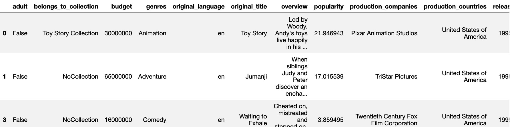

# Movie Production Investment - Data Science Capstone Project
## What is this about?
For a 3 month immersive course in Data Science, I worked on a Movie Production Investment project to predict movies that would be successful or have a high review score. With the increase of streaming platforms and the consumption of movies as “fast” culture, I wanted to analyse a regression and classification model focused on budget, tagline, IMDb voting scores of films.

This would be targeted to cultural investors, corporates interested in investing in the arts, film production companies, government cultural departments or even film councils and festivals.

The success metrics would be revenue, ROI, IMDb score and valid investment.

Apart from the regression and classification models to determine, I will also use an NLP to review which keywords are more likely used in successful movies.

You can find the full final presentation here: [Presentation](https://drive.google.com/file/d/1-cqwSO-wGt8CFqMnzYn_a93Pg9LWIWXW/view?usp=sharing)

## The Data
The dataset has come from Kaggle: [link](https://www.kaggle.com/rounakbanik/the-movies-dataset?select=movies_metadata.csv) and reports on movies from 1902 up to July 2017. It has 45,000 rows and 23 columns.

The data within the columns was not as clean as I would like, so with slicing and Regex I have managed to have more readable and comparable data. 

Once I cleaned all the data, I created new variables such as year, month and day release, as well as ROI. After deleting all rows that didn't have a revenue or budget, I realized that my dataset had been reduced to less than 15%. As films were from such a large time frame, I have also taken into consideration the inflation throughout the years.

Here is a snap of what the data looked like at the end:

## EDA
Whilst doing the EDA, I realised that many film productions had very high, or low numbers and have done some cleaning to take away outliers. Analysing the heatmap, I realized that the ROI is not very correlated to the variables, which made me review how we could do not only a regression but also a classification problem. 

It was also very important to understand what are the most profitable production companies, genres, countries and year. 

## Modeling
I decided to split this into three parts: Regression, Classification and NLP.

### Regression
I have done regression modeling with ROI, Vote Average and Revenue (after inflation) and used Linear Regression, Ridge, Lasso, Elastic Net, Gradient Boosting Regressor and MLP Regressor. Best scores for each target variable are:

#### ROI
Gradient Boosting Regressor
| Best Mean Cross Validation Score | Train Score | Test Score|
| :---: | :---: | :---: |
| -1621860.726 | 0.9892423 | 0.30540365 |

#### Vote Average
RidgeCV
| Best Mean Cross Validation Score | Train Score | Test Score|
| :---: | :---: | :---: |
| 0.094356950 | 0.61227065 | 0.3238311333 |

#### Revenue
Gradient Boosting Regressor
| Best Mean Cross Validation Score | Train Score | Test Score|
| :---: | :---: | :---: |
| 0.8809531 | 0.57763 | 0.788107 |

### Classification
As the ROI regression didn't go as well as expected, I created a new boolean variable, valid_investment, where if the return on investment is bigger than 100%, it is a valid investment, otherwise it is not. With that, I have done a classification analysis. The models used were Logistic Regression and Naive Bayes with GridSearchCV. The best score was with Logistic Regression:
| Best Score | Train Score | Test Score|
| :---: | :---: | :---: |
| 0.8951162 |  0.99883 | 0.894981 |

I wanted to take a look if there would be any difference if we did a split between pre and after 2011, boom of streaming services, and refitted the models with this new train/test split. The models used were again Logistic Regression and Naive Bayes with GridSearchCV and the best score was again with Logistic Regression:
| Best Score | Train Score | Test Score|
| :---: | :---: | :---: |
| 0.93148| 0.9954659 | 0.906116 |

### Natural Language Processing
I was also interested in the doing NLP in the taglines of movies and have also created a word cloud to understand which words were mostly used. 
Here are the scores using Logistic Regressionwith GridsearchCV
| Best Score | Train Score | Test Score|
| :---: | :---: | :---: |
| 1.0 | 1.0 | 0.9994535519125683 |

## Further Developments:
There are a few further analysis and software I would like to add and implement. I would like to continue analytics with vote and popularity, add data with webscrapping, as well as a recommendation method on rating. I would also like to present my EDA on Tableau, as well as fit further models on Classification and NLP.

Full code can be found here: 
https://nbviewer.jupyter.org/github/oliceci/Data-Science-Capstone/blob/main/Final_Capstone_Movie_Investment.ipynb
